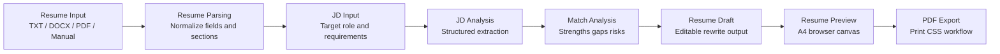
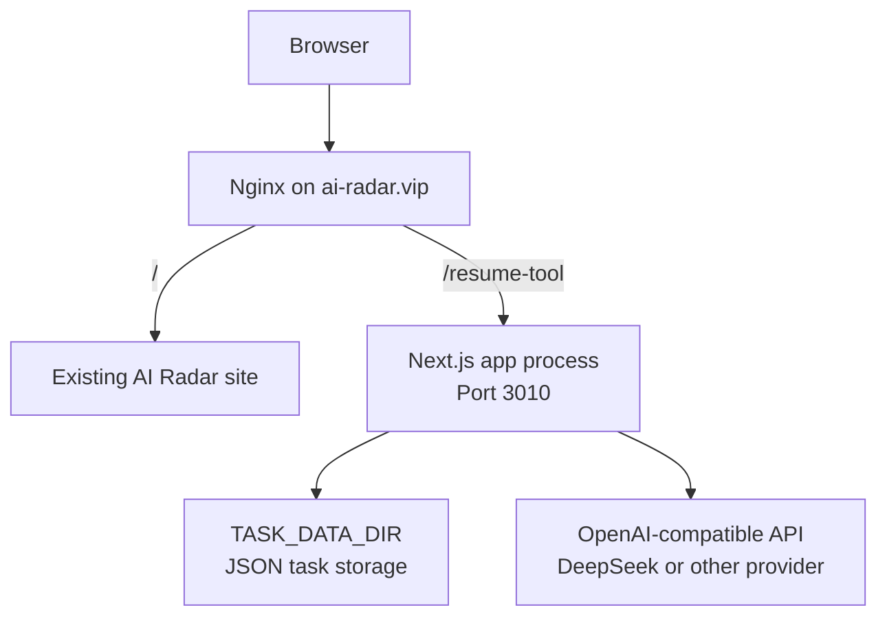

# resume-ai-assistant

[](https://nextjs.org/)
[](https://react.dev/)
[](https://www.typescriptlang.org/)
[](https://tailwindcss.com/)
[](docs/ALIYUN_DEPLOYMENT.md)

A JD-driven resume assistant MVP built with Next.js for resume parsing, job-match analysis, rewrite drafts, and browser-based PDF export.

## Quick Links

1. [Quick Start](#quick-start)
2. [Deployment](#deployment)
3. [Contributing](#contributing)
4. [Known Limitations](#known-limitations)
5. [Roadmap](#roadmap)

## Use Cases

This project is currently most useful for:

1. turning a rough existing resume into a JD-targeted application draft
2. checking whether a candidate is broadly aligned with a target role before rewriting
3. generating a cleaner resume editing surface from imported PDF, DOCX, or raw text content
4. exporting a demo-ready PDF from a browser-based A4 preview flow

## What It Does

This project turns a rough resume plus a target job description into a more decision-ready application flow:

1. import or paste resume content
2. parse and normalize resume fields
3. analyze the target JD
4. generate a match report with strengths, gaps, and risks
5. produce an editable resume draft with PDF-ready export

## Current MVP Scope

The current product boundary is intentionally narrow and focused on the core resume workflow:

1. experience intake and resume parsing
2. JD structured analysis
3. job-match analysis with explanations
4. rewrite-ready resume draft generation
5. browser PDF export from a dedicated A4 preview canvas

Out of scope for now:

1. interview simulation
2. enterprise ranking systems
3. full job search workflow management
4. account/authentication features

## Stack

1. Next.js 16 App Router
2. React 19
3. TypeScript
4. Tailwind CSS v4
5. JSON-file task persistence for the current MVP
6. OpenAI-compatible external analysis provider support

## Key Features

1. TXT, DOCX, and PDF resume import
2. deterministic fallback analysis when external AI config is missing
3. Chinese input stability for controlled form editing and IME composition
4. editable resume preview with print-focused PDF output
5. same-domain subpath deployment support such as `/resume-tool`
6. Alibaba Cloud one-click deployment script for Nginx + systemd

## Demo Flow

The current end-to-end flow is designed for a single focused resume-optimization session:

1. create a task
2. import a resume or fill in experience manually
3. paste the target JD and run structured analysis
4. review match strengths, gaps, and risk signals
5. jump into the generated resume draft
6. edit the final version and export from the A4 PDF preview

## Product Flow Diagram



## Deployment Diagram



## Quick Start

This repository uses the vendored Node.js runtime under `.tools/node` on the original development machine. In the `web/` app:

```bash
PATH="$PWD/.tools/node/bin:$PATH"
cd web
npm install
npm run dev
```

Or use the existing local scripts:

```bash
cd web
npm run dev:local
```

Then open:

```bash
http://localhost:3000
```

## Environment Variables

Copy the app example file and fill in what you need:

```bash
cp web/.env.example web/.env.local
```

Important variables:

1. `NEXT_PUBLIC_APP_NAME`
2. `NEXT_PUBLIC_APP_URL`
3. `NEXT_PUBLIC_APP_BASE_PATH`
4. `ANALYSIS_API_BASE_URL`
5. `ANALYSIS_API_KEY`
6. `ANALYSIS_API_MODEL`
7. `ANALYSIS_API_PATH`
8. `TASK_DATA_DIR`

If no external analysis credentials are configured, the app falls back to the local deterministic engine.

## Deployment

For Alibaba Cloud deployment behind an existing domain on a child path such as `https://ai-radar.vip/resume-tool`:

1. deployment guide: [docs/ALIYUN_DEPLOYMENT.md](docs/ALIYUN_DEPLOYMENT.md)
2. one-click script: [deploy/alicloud/deploy.sh](deploy/alicloud/deploy.sh)

The production deployment model is:

1. existing site keeps the root path
2. this app runs on an isolated local port
3. Nginx proxies a child path such as `/resume-tool`

Example deployment command:

```bash
sudo APP_DOMAIN=ai-radar.vip \
	APP_BASE_PATH=/resume-tool \
	APP_PORT=3010 \
	NGINX_SERVER_CONF=/etc/nginx/sites-available/ai-radar \
	ANALYSIS_API_BASE_URL=https://api.deepseek.com \
	ANALYSIS_API_KEY=your-key \
	ANALYSIS_API_MODEL=deepseek-v4-flash \
	bash deploy/alicloud/deploy.sh
```

## Project Structure

1. [web](web) — Next.js application
2. [docs](docs) — project memory, status log, and deployment notes
3. [deploy](deploy) — deployment automation
4. [AGENTS.md](AGENTS.md) — repository workflow contract

## Contributing

Contributions are welcome, but this repository is still moving inside a narrow MVP boundary.

Before opening a larger feature change, align it with the current scope:

1. keep work focused on the JD-driven resume decision flow
2. avoid broadening into a full job-search platform without an explicit scope decision
3. prefer small, testable changes over large mixed refactors

For contribution expectations and local workflow notes, see [CONTRIBUTING.md](CONTRIBUTING.md).

## Known Limitations

1. the current MVP uses JSON-file task persistence instead of a production database
2. browser PDF export is based on print CSS, so output quality depends on browser print behavior
3. there is no authentication or user workspace isolation yet
4. resume generation is optimized for the current JD-driven workflow, not a full career platform
5. some deployment assumptions still target a single-server Nginx + systemd setup

## Roadmap

1. add task history and multi-session navigation
2. improve resume parser confidence signals and section recovery
3. add stronger production persistence and storage strategy
4. refine PDF export polish and template quality
5. evaluate a cleaner local-only or privacy-first production architecture

## Status

This repository is currently an MVP with validated local development, external-analysis integration, PDF export flow, and Alibaba Cloud subpath deployment support.